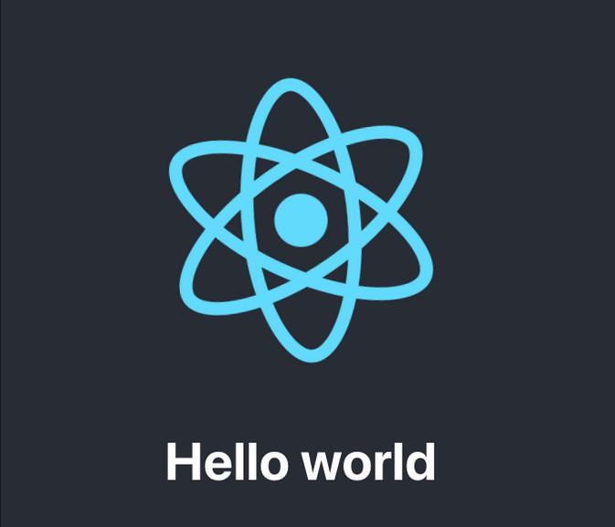
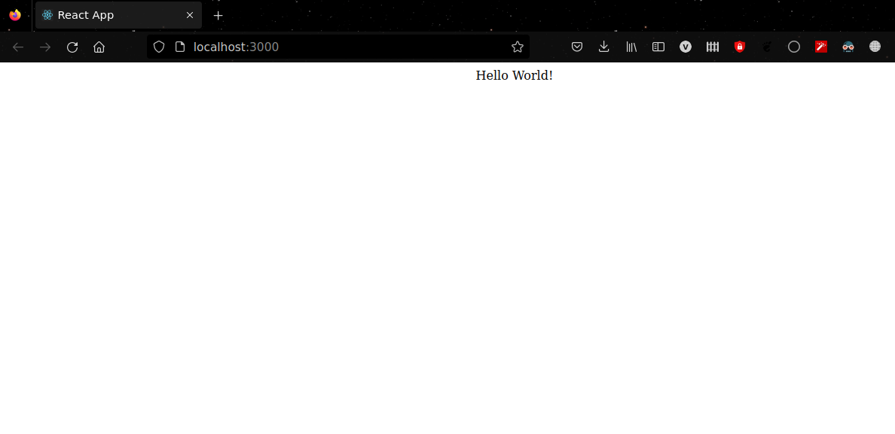

# Introduction

Starting something new can be a confusing time, especially when you're eager to begin but can't find a reference or tutorial to start from scratch. In this guide, we'll take you through the process of creating a "Hello World" React app to help you get started.

## Requirements

Before we begin, make sure you have Node.js installed. If you haven't already, you can [install Node.js here](https://nodejs.org/).

# Creating the App

Now that we have our environment set up, let's create our React app. We'll name this project 'firstapp'.


## Command

To create your React app, open your terminal and type the following command:

```bash
$ npx create-react-app firstapp


```


# React Project Structure

After successfully creating our app, let's take a look at the folder structure. The project structure consists of the following files and directories:

- **firstapp/**
  - **node_modules/** *(auto-generated)*
  - **public/**
    - **favicon.ico**
    - **index.html**
    - **logo192.png**
    - **logo512.png**
    - **manifest.json**
  - **src/**
    - **App.css**
    - **App.js**
    - **App.test.js**
    - **index.css**
    - **index.js**
    - **logo.svg**
    - **reportWebVitals.js**
    - **setupTests.js**
  - **.gitignore**
  - **package.json**
  - **README.md**
  - **yarn.lock** *(or npm's equivalent)*

This structure is the default output after running the `npx create-react-app firstapp` command, and it includes essential files and directories for a React project.

## node_modules

This folder contains all the standard Node.js packages that have been installed via npm (Node Package Manager).

## package.json

The `package.json` file is a crucial part of a Node.js project. It lists all the Node package dependencies your project relies on and includes project configurations. This file is essential for managing dependencies, scripts, and other project details.

You can explore the `node_modules` folder for installed packages and review and modify the `package.json` file to manage your project's dependencies and settings.


## package-lock.json

The `package-lock.json` file is automatically generated for any npm operations that modify either the `node_modules` tree or `package.json`. It provides a detailed description of the project's dependency tree, ensuring consistent installations across different development environments.

## public folder

The `public` folder holds various development files, including logo icons, `favicon.ico`, `index.html`, etc. The `index.html` file is the main HTML file for your React app and is typically displayed at http://localhost:3000 when you run your development server.

The `App.js` file located in the `src` folder contains the boilerplate code for our "Hello World" app. This is where you will start building the main components of your React application.

 ```js
import logo from './logo.svg';
import './App.css';

function App() {
  return (
    <div className="App">
      <header className="App-header">
        
        <p>
          Edit <code>src/App.js</code> and save to reload.
        </p>
        <a
          className="App-link"
          href="https://reactjs.org"
          target="_blank"
          rel="noopener noreferrer"
        >
          Learn React
        </a>
      </header>
    </div>
  );
}

export default App;
```
# Starting the App

Now that we've discussed enough about the project structure, let's get started with the execution and see how our first app looks like.

In your terminal, just type:

```bash
$ npm start
```


Hello world
As everything is working fine its time to run our favourite line of code,yes you guess it right it’s “Hello World” .

 ```js

import logo from './logo.svg';
import './App.css';

function App() {
  return (
    <div className="App">
      <header className="App-header">
        
        <h1>Hello world</h1>
      </header>
    </div>
  );
}

export default App;
 ```
 

 And that’s it you just run the ‘Hello World’ program in your browser

Your next task is to remove all the unnecessary code from app.js and then run a clean hello world program.



Congratulations you just created your first React app.Your next task will be continuing to learn the concepts of react.js.The best will be if you overlook at the documentation.

Thank you for your time,will be uploading about React futher.See you soon!